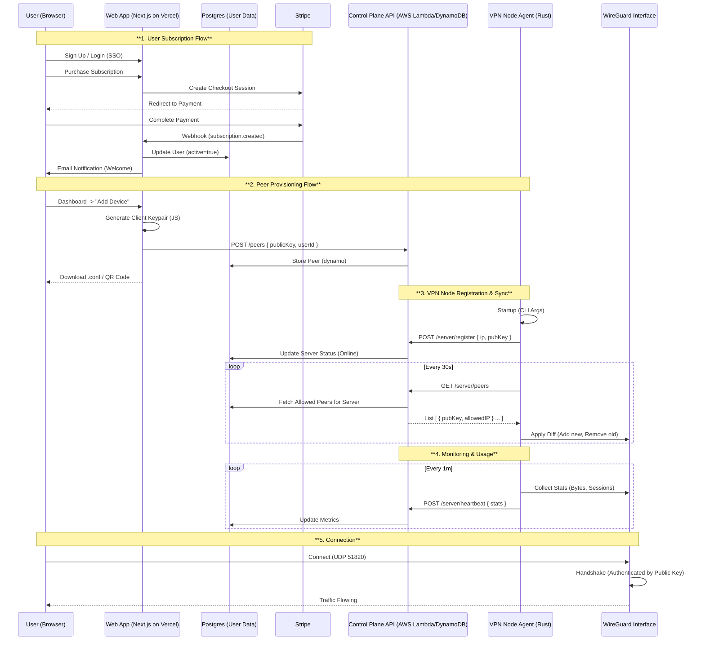

# vpnVPN — Project Documentation and Specification

## 1. Executive Summary

vpnVPN is a privacy-first, verified-data-flow VPN SaaS platform. It lets customers subscribe to encrypted VPN access, choose exit locations, and manage their devices, while operators manage a global fleet of VPN nodes across EC2, VPS, or bare metal.

Key pillars:

- **Privacy & Security:** No traffic logging, strong modern ciphers (WireGuard, OpenVPN, IKEv2), end-to-end TLS on control APIs, and a minimal-metadata model.
- **Universal Deployment:** Node agent (`vpn-server`) runs as a binary or Docker container on Linux, macOS, and Windows hosts, including EC2 and generic VPS.
- **Full SaaS Frontend:** A production-grade Next.js app on Vercel for marketing, signup, billing, user dashboards, and admin operations.
- **Verifiable Data Flow:** All cross-service communication is explicit, documented, and testable end-to-end in local and production-like environments (no mock APIs in the main flows).

## 2. System Architecture

### 2.1 Frontend App (`web-app`)

Full-stack Next.js SaaS application hosted on **Vercel**.

- **Roles**
  - Public: landing, pricing, docs, signup/login.
  - User: dashboard to view subscription status, manage devices, download configs/QR codes, pick servers/regions, and view aggregate usage.
  - Admin: secure panel to monitor the fleet, manage users and peers, issue/revoke node tokens, and inspect proxy pool status.
- **SaaS Capabilities**
  - **Authentication:** NextAuth.js (Auth.js) with GitHub, Google, and email (magic link).
  - **Billing:** Stripe subscriptions (checkout, portal, webhooks) for monthly/yearly plans.
  - **Notifications:** Transactional email (welcome, billing changes, security alerts) via Resend or SendGrid.
  - **Access Control:** RBAC and subscription gating (`requirePaidUser`) for all paid endpoints and pages.
- **Tech Stack**
  - Next.js App Router, React, TypeScript (strict), Tailwind CSS, Prisma + PostgreSQL, Stripe, AWS SDK.
- **Hosting & Best Practices**
  - Deployed on Vercel with environment variables managed via Vercel project settings.
  - Sensitive values never committed; no `.env` files in git.
  - Uses Vercel Edge/Node runtimes for middleware and API routes where appropriate.

### 2.2 Control Plane (AWS)

Central API and state store that coordinates users, peers, and nodes.

- **Responsibilities**
  - **Server Registry:** VPN nodes self-register and send periodic heartbeats.
  - **Peer Management:** Stores and serves allowed peers (device public keys, allowed IPs) to nodes.
  - **Proxy Pool:** Ingests, normalizes, and exposes a pool of HTTP(S) proxies for advanced features.
  - **Billing & Entitlements:** Receives Stripe webhooks and keeps subscription state in sync.
- **Infrastructure**
  - AWS API Gateway (HTTP API v2) → container-based Lambda functions (Node.js 20.x) for each endpoint.
  - DynamoDB tables:
    - `vpnServers`: node registry (id, status, lastSeen, protocols, metadata).
    - `vpnPeers`: device peers (publicKey, userId, allowedIps, server assignment).
    - `vpnTokens`: node registration tokens.
    - `proxies`: proxy pool items and metadata.
  - Provisioned and updated via Pulumi (TypeScript), with separate stacks for `global` and regional resources.

### 2.3 VPN Node Agent (`vpn-server`)

Rust binary (and Docker image) that runs on host machines and controls underlying VPN daemons.

- **Protocols**
  - WireGuard (primary, high-performance).
  - OpenVPN (compatibility).
  - IKEv2/IPsec (enterprise and OS-native support).
- **Capabilities**
  - **Self-Registration:** On startup, calls `POST /server/register` with its WireGuard public key, listen ports, and host metadata.
  - **Sync Loop:** On a fixed interval, calls `GET /server/peers` and applies peers to all enabled backends.
  - **Health & Metrics:** Publishes aggregate metrics (active sessions, bytes per protocol) via `POST /server/heartbeat` and CloudWatch.
  - **Doctor Mode:** `vpn-server doctor` checks for required binaries, kernel modules, TUN/TAP devices, and AWS environment when applicable.
- **Configuration**
  - Primary via CLI flags (e.g. `vpn-server run --api-url ... --token ... --listen-port 51820`).
  - Environment variables are supported as a convenience, but `.env` files are not required or recommended for production.

## 3. Privacy, Security & Data Model

### 3.1 Privacy Guarantees

- **No Traffic Logging**
  - VPN protocols (WireGuard, OpenVPN, IKEv2) are configured with logging disabled or minimized to operational errors.
  - No packet contents or per-flow metadata are stored.
- **Minimal Metadata**
  - Nodes and control plane only exchange:
    - Aggregate active session counts.
    - Aggregate bytes in/out per protocol.
    - Device public keys and allowed IPs.
  - No long-term storage of client IP addresses or DNS queries.
- **Encryption**
  - WireGuard: ChaCha20-Poly1305.
  - OpenVPN: AES-256-GCM (or equivalent modern cipher suites).
  - IKEv2: strongSwan with modern proposals (e.g. AES-256 + SHA-256 + PFS).
  - All control-plane HTTP APIs served over TLS (HTTPS) in production.

### 3.2 Logical Data Model

- **User (Postgres)**
  - `id`, `email`, `name`, `stripeCustomerId`, timestamps.
  - `subscriptions[]`, `devices[]`, `notificationPreferences`.
- **Subscription (Postgres)**
  - `id`, `userId`, `stripeSubscriptionId`, `status`, `priceId`, `currentPeriodEnd`.
- **Device / Peer**
  - In Postgres: `Device` (UI-level entity with `id`, `userId`, `name`, `publicKey`).
  - In DynamoDB: `vpnPeers` (network-level entity with `publicKey`, `userId`, `allowedIps`, `createdAt`, `serverAssignment`).
- **Server (DynamoDB)**
  - `vpnServers`: `id` (node identifier), `publicIp`, `status`, `lastSeen`, `protocols`, `metrics`, `metadata`.
- **Proxy (DynamoDB)**
  - `proxies`: `proxyId`, `type`, `ip`, `port`, `latency`, `score`, `country`, `lastValidated`, `source`.

### 3.3 VPN Server Control Loop

1. **Startup**
   - Parse CLI args: `--api-url`, `--token`, `--listen-port`, optional flags for enabled protocols.
   - Run `vpn-server doctor` implicitly in non-strict mode to warn about missing capabilities.
   - Generate or load WireGuard private key and configuration.
2. **Register**
   - Call `POST /server/register` with:
     - Node id (instance ID or generated UUID).
     - Public IP (if detectable) and WireGuard public key.
     - Listen ports and enabled protocols.
   - Control plane validates token from `vpnTokens` and writes to `vpnServers`.
3. **Sync Loop**
   - Every N seconds:
     - Call `GET /server/peers` (authenticated via bearer token).
     - Receive a list of peers (`publicKey`, `allowedIps`, optional `endpoint`) assigned to this node.
     - Compute a diff vs current kernel/daemon state and apply changes via WireGuard/OpenVPN/IPsec backends.
4. **Metrics**
   - On a separate interval:
     - Collect aggregate session counts and bytes sent/received per protocol.
     - Call `POST /server/heartbeat` with a small JSON payload.
     - Publish CloudWatch metrics in the `vpnVPN` namespace for autoscaling and observability.

### 3.4 Infrastructure as Code

- **Pulumi (TypeScript)**
  - `global` stack:
    - ECR repositories for `vpn-server` and Lambda images.
    - Control-plane API Gateway and container Lambdas.
    - Observability (CloudWatch, AMP, Grafana).
  - `region-*` stacks:
    - Data-plane capacity (e.g., ASGs + NLB or ECS + NLB) that pull the `vpn-server` image.
    - Security groups, routing, and autoscaling policies based on `ActiveSessions` metrics.

## 4. End-to-End Data Flow

## 5. Local Development & Testing (No Mocks)

- Local development is done against real components:
  - `web-app` in dev mode.
  - Control plane deployed to LocalStack (DynamoDB, Lambda, API Gateway).
  - `vpn-server` container running with `NET_ADMIN` and TUN in Docker.
  - Postgres for Prisma.
- All local integration tests exercise the same HTTP APIs as production; there are no mock control-plane implementations in the main test flow.
- `local/test-flow.sh` (or equivalent) walks the real flow:
  - Create a user in `web-app`.
  - Run a Stripe test checkout.
  - Let Stripe webhooks update subscription state.
  - Add a device from the dashboard (which calls `POST /peers`).
  - Start `vpn-server`, which registers and fetches peers.
  - Verify the peer appears in the WireGuard configuration inside the container.

## 6. Operational Runbooks

- **Adding a Node**
  - Provision a host (EC2, VPS, bare metal, or local server) with required VPN binaries.
  - Generate or retrieve a node token from the admin panel.
  - Run the `vpn-server` container or binary with `--api-url` and `--token`.
  - The node self-registers and appears in the admin fleet view; once approved (optional), it starts receiving peers.
- **Revoking a User or Device**
  - Cancel or delete the user’s Stripe subscription (or mark the account as banned in the admin UI).
  - Stripe webhook updates subscription state; the web app clears or flags peers.
  - Control plane stops returning these peers from `GET /server/peers`.
  - Nodes remove revoked peers on the next sync, cutting off VPN access.
