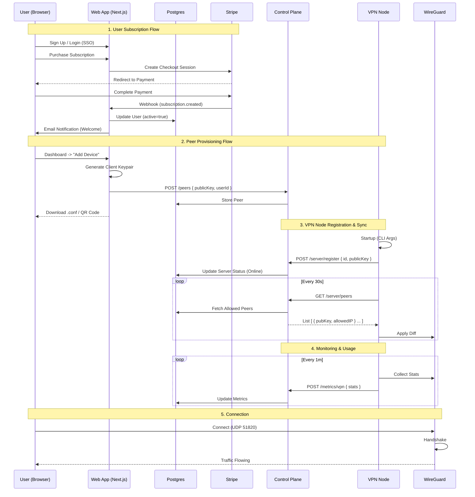

# vpnVPN — Project Documentation and Specification

## 1. Executive Summary

vpnVPN is a privacy-first, verified-data-flow VPN SaaS platform. It lets customers subscribe to encrypted VPN access, choose exit locations, and manage their devices, while operators manage a global fleet of VPN nodes across EC2, VPS, or bare metal.

Key pillars:

- **Privacy & Security:** No traffic logging, strong modern ciphers (WireGuard, OpenVPN, IKEv2), end-to-end TLS on control APIs, and a minimal-metadata model.
- **Universal Deployment:** Node agent (`vpn-server`) runs as a binary or Docker container on Linux, macOS, and Windows hosts.
- **Full SaaS Frontend:** Production-grade Next.js app on Vercel for marketing, signup, billing, user dashboards, and admin operations.
- **Verifiable Data Flow:** All cross-service communication is explicit, documented, and testable end-to-end.

## 2. System Architecture

### 2.1 Frontend App (`apps/web`)

Full-stack Next.js SaaS application hosted on **Vercel**.

- **Roles**
  - Public: landing, pricing, docs, signup/login.
  - User: dashboard to view subscription status, manage devices, download configs/QR codes, pick servers/regions.
  - Admin: secure panel to monitor the fleet, manage users and peers, issue/revoke node tokens.
- **SaaS Capabilities**
  - **Authentication:** NextAuth.js with GitHub, Google, and email (magic link).
  - **Billing:** Stripe subscriptions (checkout, portal, webhooks) for multi-tier plans.
  - **Notifications:** Transactional email via Resend.
  - **Access Control:** RBAC and subscription gating for paid endpoints.
- **Tech Stack**
  - Next.js App Router, React, TypeScript, Tailwind CSS, tRPC, Prisma + PostgreSQL, Stripe.

### 2.2 Control Plane (`services/control-plane`)

Bun/Fastify HTTP API backed by PostgreSQL via Prisma.

- **Responsibilities**
  - **Server Registry:** VPN nodes self-register and can be listed.
  - **Peer Management:** Stores and serves allowed peers to nodes.
  - **Token Management:** Issue and revoke node registration tokens.
- **Endpoints**
  - `POST /server/register` — Node registration (bearer token auth).
  - `GET /server/peers` — Peer list for a server (bearer token auth).
  - `GET /servers` — List all servers (API key auth).
  - `POST /peers` — Create/update peer (API key auth).
  - `POST /peers/revoke-for-user` — Revoke all peers for a user (API key auth).
  - `DELETE /peers/:publicKey` — Revoke specific peer (API key auth).

### 2.3 Metrics Service (`services/metrics`)

Bun/Fastify HTTP API for vpn-server metrics ingestion.

- **Endpoint:** `POST /metrics/vpn` — Accepts CPU, memory, active peers, and region data.
- Persists metrics to PostgreSQL for dashboard views.

### 2.4 VPN Node Agent (`apps/vpn-server`)

Rust binary (and Docker image) that runs on host machines.

- **Protocols**
  - WireGuard (primary, high-performance).
  - OpenVPN (compatibility).
  - IKEv2/IPsec (enterprise and OS-native support).
- **Capabilities**
  - **Self-Registration:** On startup, calls `POST /server/register` with WireGuard public key, listen ports, and host metadata.
  - **Sync Loop:** Periodically calls `GET /server/peers` and applies peers to all enabled backends.
  - **Health & Metrics:** Publishes aggregate metrics via the metrics service.
  - **Admin API:** Exposes `/health`, `/metrics`, `/status`, `/pubkey` endpoints.
- **Configuration**
  - Primary via CLI flags and environment variables.

## 3. Privacy, Security & Data Model

### 3.1 Privacy Guarantees

- **No Traffic Logging:** VPN protocols are configured with logging disabled.
- **Minimal Metadata:** Only aggregate session counts, bytes in/out, and device public keys are stored.
- **Encryption:**
  - WireGuard: ChaCha20-Poly1305.
  - OpenVPN: AES-256-GCM.
  - IKEv2: strongSwan with modern proposals.
  - All control APIs served over TLS.

### 3.2 Logical Data Model

- **User (Postgres):** `id`, `email`, `name`, `stripeCustomerId`, timestamps.
- **Subscription (Postgres):** `stripeSubscriptionId`, `status`, `priceId`, `tier`, `currentPeriodEnd`.
- **Device (Postgres):** UI-level entity with `name`, `publicKey`, `serverId`.
- **VpnPeer (Postgres):** Network-level entity with `publicKey`, `userId`, `allowedIps`, `serverId`.
- **VpnServer (Postgres):** `id`, `status`, `lastSeen`, `metadata`.
- **VpnToken (Postgres):** Node registration tokens with `label`, `usageCount`, `active`.
- **VpnMetric (Postgres):** Time-series metrics per server.

### 3.3 VPN Server Control Loop

1. **Startup:** Parse CLI args, run diagnostics, generate/load WireGuard keys.
2. **Register:** Call `POST /server/register` with node identity and public key.
3. **Sync Loop:** Periodically fetch peers from control plane and apply to backends.
4. **Metrics:** Report health and session counts to metrics service.

## 4. Infrastructure

### 4.1 Pulumi (TypeScript)

- **`global` stack:**
  - ECR repository for vpn-server images.
  - Control-plane URL configuration.
  - Observability (AMP, Grafana).
- **`region-*` stacks:**
  - VPC, NLB, security groups.
  - EC2 Auto Scaling Group running vpn-server containers.
  - Target-tracking autoscaling based on ActiveSessions metric.

### 4.2 Deployment Options

The control plane and metrics services are container-based and can run on:

- AWS (ECS, EC2, EKS)
- Kubernetes
- Docker Compose
- On-premises servers

## 5. End-to-End Data Flow

## 6. Local Development

Local development uses Docker Compose with real components:

- `web-app` in dev mode
- `control-plane` service with Postgres
- `metrics` service
- `vpn-server` container with `NET_ADMIN` capability

All integration tests exercise real HTTP APIs; no mock implementations.

See `docs/LOCAL_DEV.md` for setup instructions.

## 7. Operational Runbooks

### Adding a Node

1. Provision a host with required VPN binaries.
2. Generate or retrieve a node token from the admin panel.
3. Run `vpn-server` with `--api-url` and `--token`.
4. The node self-registers and starts receiving peers.

### Revoking a User or Device

1. Cancel the user's Stripe subscription or mark the account as banned.
2. Stripe webhook updates subscription state.
3. Control plane marks peers as inactive.
4. VPN nodes remove revoked peers on next sync.
